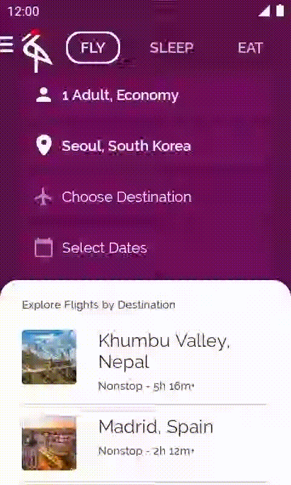

# Voyage

    
    
    
    

## Example App for Searching Tourist Destinations 🗺️

This app is a basic example of how to create an Android app that allows you to search for tourist destinations.

**Features:**

* **Simple Search:** Allows searching for destinations by city or country name. 🔍
* **Basic Information:** Displays basic information about each destination (name, description, image). ℹ️
* **Simple Interface:** Uses a basic user interface for easy navigation. 🧭

**Technologies:**

* **Jetpack Compose:** For the user interface. 🎨
* **Kotlin:** As the programming language. 💻
* **Google Maps Libs:** For displaying the destinations on a map. 🗺

**Note:** This app is a basic example and is not intended for production use. 🚧

**Objective:**

This project aims to serve as a starting point for learning how to develop Android apps with Jetpack Compose and Kotlin. 📚

**Contributions:**

Contributions are welcome. If you find any bugs or have any suggestions to improve the app, please open an issue or create a pull request. 🤝

## Demo Video

Check out this video to see the app in action:

## Prerequisites

- [Android Studio](https://developer.android.com/studio)
- Java JDK 11 or higher
- Android SDK

### Built With
- Kotlin
- Jetpack Compose
- Material Design